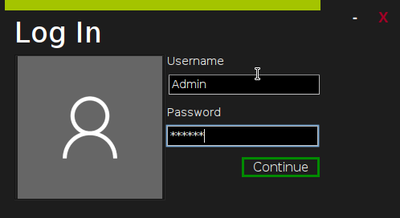

# MetroMaven
Metro is a simple semi-encrypted notekeeping app written in java.

---
A gradle version of [this](https://github.com/jonnelafin/MetroTest).

# How Do I Get It?
Binaries are avaible in the [releases tab](https://github.com/jonnelafin/MetroGradle/releases) above.

# Default Credentials

User: Admin

Password: Hunter2

Deleting the users.ser file restores the user above. (deletes all data and users too :D)

# How Do I Remove The Default User?
1. Login with it.

2. Head in to the settings and add a new user

3. Log out of the default user

4. Login with your new user

5. Head in to the settings and delete "admin"

6. You are done!

# Screenshots

# Files
The program creates 2 files upon the user saving their notes or making changes to usermanagement:

users.ser . . . . . . . . . remembers all users and their password hashes

userdata.ser. . . . . . . remembers all userdata (notes)
